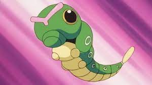
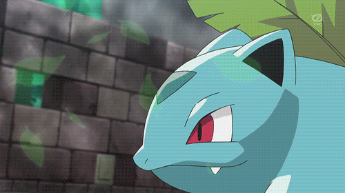
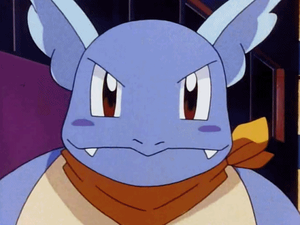
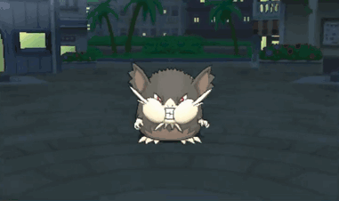

# Pokemon-Duniya
<!DOCTYPE>
<html>
<head>
<title>Pokemon Duniya</title>

  </head>
  <body>

    <form role="search" id="form">
      <input type="search" id="query" name="q" placeholder="Google Search..." aria-label="Search through site content">
      <button class="button1">
        <svg viewBox="0 0 1024 1024"><path class="path1" d="M848.471 928l-263.059-263.059c-48.941 36.706-110.118 55.059-177.412 55.059-171.294 0-312-140.706-312-312s140.706-312 312-312c171.294 0 312 140.706 312 312 0 67.294-24.471 128.471-55.059 177.412l263.059 263.059-79.529 79.529zM189.623 408.078c0 121.364 97.091 218.455 218.455 218.455s218.455-97.091 218.455-218.455c0-121.364-103.159-218.455-218.455-218.455-121.364 0-218.455 97.091-218.455 218.455z"></path></svg>
      </button>
    </form>

<button class="button2"><a href= "#allpoki" style= "text-decoration: none; color: black;">All Pokemons</button>

<h2><a id= "allpoki">List</a></h2>

  
  
<a href= "#bulbasaur" style= "color: black;">Bulbasaur</a>

  
  
<a href= "#ivysaur" style= "color: black;">Ivysaur</a>

  
  
<a href= "#venusaur" style= "color: black;">Venusaur</a>

  
  
<a href= "#charmander" style= "color: black;">Charmander</a>

  
  
<a href= "#charmeleon" style= "color: black;">Charmeleon</a>

  
  
<a href= "#charizard" style= "color: black;">Charizard</a>

  
  
<a href= "#squirtle" style= "color: black;">Squirtle</a>

  
  
<a href= "#wartortle" style= "color: black;">Wartortle</a>

  
  
<a href= "#blastoise" style= "color: black;">Blastoise</a>

  
  
<a href= "#caterpie" style= "color: black;">Caterpie</a>

  
  
<a href= "#metapod" style= "color: black;">Metapod</a>

  
  
<a href= "#butterfree" style= "color: black;">Butterfree</a>

  
  
<a href= "#weedle" style= "color: black;">Weedle</a>

  
  
<a href= "#kakuna" style= "none; color: black;">Kakuna</a>

  
  
<a href= "#beedrill" style= "color: black;">Beedrill</a>

  
  
<a href= "#rattata" style= "color: black;">Rattata</a>

  
  
<a href= "#raticate" style= "color: black;">Raticate</a>

  
  
<a href= "#pidgey" style= "color: black;">Pidgey</a>

  
  
<a href= "#pidgeotto" style= "color: black;">Pidgeotto</a>

  
  
<a href= "#pidgeot" style= "color: black;">Pidgeot</a>

    

 

<h1><a id= "bulbasaur">Bulbasaur</a></h1>
<table <a>
<tr>
<th></th>
<th>
<ul>
<li>Height: 71.1cm</li> 
<li>Weight: 6.9kg</li> 
<li>Evolves to: Ivysaur</li> 
<li>Ability: Overgrow</li> 
<li>Category: Seed</li> 
<li>Type: Grass, Poison</li> 
<li>Weakness: Psychic, Flying, Ice, Fire</li> 
</ul>
</th>
</tr>
</table>

 
<h1><a id= "ivysaur">Ivysaur</a></h1>
<table>
<tr>
<th>
<ul>
<li>Height: 99.1cm</li> 
<li>Weight: 13kg</li> 
<li>Evolves to: Venusaur</li> 
<li>Evolves from: Bulbasaur</li> 
<li>Ability: Overgrow</li> 
<li>Category: Seed</li> 
<li>Type: Grass, Poison</li> 
<li>Weakness: Psychic, Flying, Ice, Fire</li> 
</ul>
</th>
<th></th>
</tr>
</table>

 
<h1><a id= "venusaur">Venusaur</a></h1>
<table>
<tr>
<th></th>
<th>
<ul>
<li>Height: 2.01m</li> 
<li>Weight: 100kg</li> 
<li>Evolves from: Ivysaur</li> 
<li>Ability: Overgrow</li> 
<li>Category: Seed</li> 
<li>Type: Grass, Poison</li> 
<li>Weakness: Psychic, Flying, Ice, Fire</li> 
</ul>
</th>
</tr>
</table>

 
<h1><a id= "charmander">Charmander</a></h1>
<table>
<tr>
<th>
<ul>
<li>Height: 61cm</li> 
<li>Weight: 8.5kg</li> 
<li>Evolves to: Charmeleon</li> 
<li>Ability: Blaze</li> 
<li>Category: Lizard</li> 
<li>Type: Fire</li> 
<li>Weakness: Water, Ground, Rock</li> 
</ul>
</th>
<th></th>
</tr>
</table>

 
<h1><a id= "charmeleon">Charmeleon</a></h1>
<table>
<tr>
<th></th>
<th>
<ul>
<li>Height: 1.09m</li> 
<li>Weight: 19kg</li> 
<li>Evolves to: Charizard</li> 
<li>Evolves from: Charmander</li> 
<li>Ability: Blaze</li> 
<li>Category: Lizard</li> 
<li>Type: Fire</li> 
<li>Weakness: Water, Ground</li> 
</ul>
</th>
</tr>
</table>

 
<h1><a id= "charizard">Charizard</a></h1>
<table>
<tr>
<th>
<ul>
<li>Height: 1.7m</li> 
<li>Weight: 90kg</li> 
<li>Evolves from: Charmeleon</li> 
<li>Ability: Blaze</li> 
<li>Category: Lizard</li> 
<li>Type: Fire, Flying</li> 
<li>Weakness: Water, Rock, Electric</li> 
</ul>
</th>
<th></th>
</tr>
</table>

 
<h1><a id= "squirtle">Squirtle</a></h1>
<table>
<tr>
<th></th>
<th>
<ul>
<li>Height: 50.8cm</li> 
<li>Weight: 9kg</li> 
<li>Evolves to: Wartortle</li> 
<li>Ability: Torrent</li> 
<li>Origin: Kanto</li> 
<li>Type: Water</li> 
<li>Weakness: Grass, Electric</li> 
</ul>
</th>
</tr>
</table>

 
<h1><a id="wartortle">Wartortle</a></h1>
<table>
<tr>
<th>
<ul>
<li>Height: 99.1cm</li> 
<li>Weight: 22kg</li> 
<li>Evolves to: Blastoise</li> 
<li>Evolves from: Squirtle</li> 
<li>Ability: Torrent</li> 
<li>Type: Water</li> 
<li>Weakness: Grass, Electric</li> 
</ul>
</th>
<th></th>
</tr>
</table>

 
<h1><a id= "blastoise">Blastoise</a></h1>
<table>
<tr>
<th></th>
<th>
<ul>
<li>Height: 1.6m</li> 
<li>Weight: 86kg</li> 
<li>Evolves from: Wartortle</li> 
<li>Ability: Torrent</li> 
<li>Type: Water</li> 
<li>Category: Shellfish</li> 
<li>Weakness: Grass, Electric</li> 
</ul>
</th>
</tr>
</table>

 
<h1><a id= "caterpie">Caterpie</a></h1>
<table>
<tr>
<th>
<ul>
<li>Height: 30.5cm</li> 
<li>Weight: 2.9kg</li> 
<li>Evolves to: Metapod</li> 
<li>Type: Bug</li> 
<li>Weakness: Flying, Fire, Rock</li> 
</ul>
</th>
<th></th>
</tr>
</table>

 
<h1><a id= "metapod">Metapod</a></h1>
<table>
<tr>
<th></th>
<th>
<ul>
<li>Height: 71.1cm</li> 
<li>Weight: 9.9kg</li> 
<li>Evolves to: Butterfree</li> 
<li>Evolves from: Caterpie</li> 
<li>Type: Bug</li> 
<li>Ability: Shed Skin</li> 
<li>Weakness: Flying, Fire, Rock</li> 
</ul>
</th>
</tr>
</table>

 
<h1><a id="butterfree">Butterfree</a></h1>
<table>
<tr>
<th>
<ul>
<li>Height: 1.1m</li> 
<li>Weight: 32kg</li> 
<li>Evolves from: Metapod</li> 
<li>Type: Bug, Flying</li> 
<li>Ability: Compound Eyes</li> 
<li>Weakness: Flying, Fire, Electric, Ice</li> 
</ul>
</th>
<th></th>
</tr>
</table>

 
<h1><a id= "weedle">Weedle</a></h1>
<table>
<tr>
<th></th>
<th>
<ul>
<li>Height: 30.5cm</li> 
<li>Weight: 3.2kg</li> 
<li>Evolves to: Kakuna</li> 
<li>Type: Bug, Poison</li> 
<li>Ability: Shield Dust</li> 
<li>Weakness: Flying, Fire, Rock, Psychic</li> 
</ul>
</th>
</tr>
</table>

 
<h1><a id= "kakuna">Kakuna</a></h1>
<table>
<tr>
<th>
<ul>
<li>Height: 61cm</li> 
<li>Weight: 10kg</li> 
<li>Evolves to: Beedrill</li> 
<li>Evolves from: Weedle</li> 
<li>Type: Bug, Poison</li> 
<li>Ability: Shed Skin</li> 
<li>Weakness: Flying, Fire, Psychic</li> 
</ul>
</th>
<th></th>
</tr>
</table>

 
<h1><a id= "beedrill">Beedrill</a></h1>
<table>
<tr>
<th></th>
<th>
<ul>
<li>Height: 99.1cm</li> 
<li>Weight: 29kg</li> 
<li>Evolves from: Kakuna</li> 
<li>Type: Bug, Poison</li> 
<li>Ability: Swam</li> 
<li>Weakness: Flying, Fire, Psychic, Rock</li> 
</ul>
</th>
</tr>
</table>

 
<h1><a id= "rattata">Rattata</a></h1>
<table>
<tr>
<th>
<ul>
<li>Height: 30.5cm</li> 
<li>Weight: 3.5kg</li> 
<li>Evolves to: Raticate</li> 
<li>Type: Normal</li> 
<li>Ability: Run Away, Guts</li> 
<li>Weakness: Fighting</li> 
</ul>
</th>
<th></th>
</tr>
</table>

 
<h1><a id= "raticate">Raticate</a></h1>
<table>
<tr>
<th></th>
<th>
<ul>
<li>Height: 71.1cm</li> 
<li>Weight: 19kg</li> 
<li>Evolves from: Rattata</li> 
<li>Type: Normal</li> 
<li>Ability: Run Away, Guts</li> 
<li>Weakness: Fighting</li> 
</ul>
</th>
</tr>
</table>

 
<h1><a id= "pidgey">Pidgey</a></h1>
<table>
<tr>
<th>
<ul>
<li>Height: 30.5cm</li> 
<li>Weight: 1.8kg</li> 
<li>Evolves to: Pidgeotto</li> 
<li>Type: Flying, Normal</li> 
<li>Ability: Tangled Feet, Keen Eye</li> 
<li>Weakness: Ice, Electric, Rock</li> 
</ul>
</th>
<th></th>
</tr>
</table>

 
<h1><a id= "pidgeotto">Pidgeotto</a></h1>
<table>
<tr>
<th></th>
<th>
<ul>
<li>Height: 1.09m</li> 
<li>Weight: 30kg</li> 
<li>Evolves to: Pidgeot</li> 
<li>Evolves from: Pidgey</li> 
<li>Type: Flying, Normal</li> 
<li>Weakness: Ice, Electric, Rock</li> 
</ul>
</th>
</tr>
</table>

 
<h1><a id= "pidgeot">Pidgeot</a></h1>
<table>
<tr>
<th>
<ul>
<li>Height: 1.5m</li> 
<li>Weight: 40kg</li> 
<li>Evolves from: Pidgeotto</li> 
<li>Type: Flying, Normal</li> 
<li>Weakness: Ice, Electric, Rock</li> 
</ul>
</th>
<th></th>
</tr>
</table>											/

    
</body>
</html>
